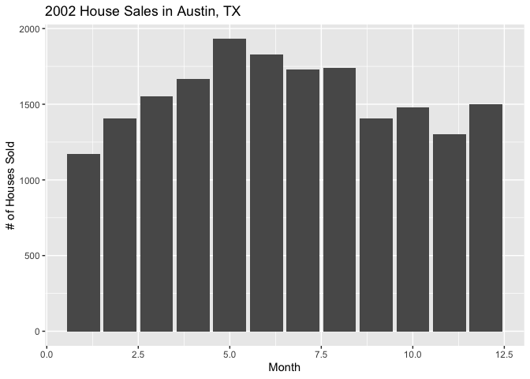

**JenZ’s Webpage**
================

## INTRO

This is an short project that displays the real estate sales and details
in Austin, Texas.

## COOL CODE

Here is some cool code that loads the packages needed and wrangles the
data so it’s easier to work with:

``` r
library(ggplot2)
library(dplyr)

txhousing2 <- txhousing %>% 
  filter(year == "2002") %>% 
  filter(city == "Austin")

glimpse(txhousing2)
```

    ## Rows: 12
    ## Columns: 9
    ## $ city      <chr> "Austin", "Austin", "Austin", "Austin", "Austin", "Austin", …
    ## $ year      <int> 2002, 2002, 2002, 2002, 2002, 2002, 2002, 2002, 2002, 2002, …
    ## $ month     <int> 1, 2, 3, 4, 5, 6, 7, 8, 9, 10, 11, 12
    ## $ sales     <dbl> 1172, 1407, 1550, 1665, 1931, 1829, 1729, 1742, 1407, 1480, …
    ## $ volume    <dbl> 242074554, 279623092, 313749244, 322148092, 383478450, 37125…
    ## $ median    <dbl> 152600, 157300, 156600, 156200, 156000, 158900, 151700, 1569…
    ## $ listings  <dbl> 6851, 7190, 7625, 8226, 9109, 9620, 9863, 9843, 9854, 9747, …
    ## $ inventory <dbl> 4.4, 4.6, 4.9, 5.3, 5.8, 6.1, 6.3, 6.3, 6.3, 6.2, 5.9, 5.7
    ## $ date      <dbl> 2002.000, 2002.083, 2002.167, 2002.250, 2002.333, 2002.417, …

## PLOTS

Here is the final plot and the code associated with creating the
txhousing2 dataset that shows you how the sale of houses vary according
to the month in Austin, Texas.

``` r
ggplot(txhousing2, aes(x = month, y = sales)) +
geom_col() +  
labs(x = "Month", y = "# of Houses Sold") +
ggtitle("2002 House Sales in Austin, TX")
```

<!-- -->

**Thank You for Viewing**
